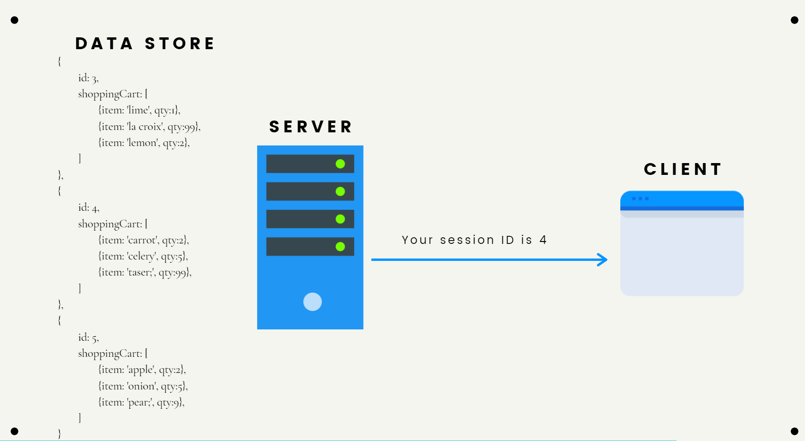
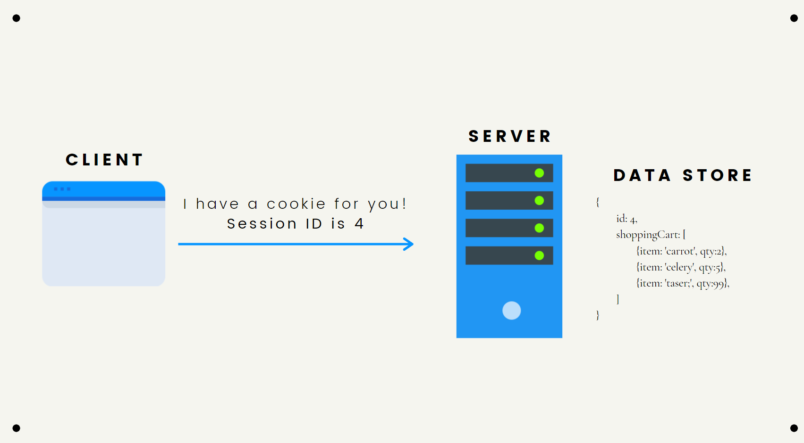

[Javascript](../../../Javascript/js.md) || [NodeJS](../../node.md) || [**Express**](express.md) || [RESTful Routes](restful_routes.md) || [MongoDB](../../../Databases/mongodb.md) || [Mongoose](mongoose.md)

1.  [Express](#express)
2.  [Installing and getting started](#installing-and-getting-started)
3.  [The Request and Response Objects (req and res)](#request-and-respond-objects)
4.  [Express Routing](#express-routing)
    - [Basics](#basic)
    - [Path parameters](#path-parameters)
    - [Working with query Strings](#working-with-query-strings)
    - [Express Routers](#express-routers)
5.  [Templating (EJS)](#templating)
    - [Configuring express for EJS](#configuring-express-for-ejs)
    - [Setting the views directory](#setting-the-view-directory)
    - [EJS interpolation syntax](#ejs-interpolation-syntax)
    - [Passing data to template](#passing-data-to-templates)
    - [Partials with ejs](#partials-with-ejs)
    - [Layouts boilerplate (ejs-mate)](#layouts-boilerplate-ejs-mate)
    -
    10. [Cookies](#cookies)[Mini Subreddit](./apps/03_mini_subreddit/mini_subreddit.md)
6.  [Serving Static Assests in Express](#serving-static-assests-in-express)
7.  [Middleware](#middleware)
    - [Concept](#middleware-concept)
    - [Defining own middlewares](#defining-own-middlewares)
    - [Writing middleware for use in express apps (**express document**)](https://expressjs.com/en/guide/writing-middleware.html)
8.  [Error Handling](#error-handling)
9.  [Related Mongoose Models](#related-mongoose-models)
10. [Cookies](#cookies)
11. [Sessions](#sessions)
12. [Flash Messages](#connect-flash)
13. [Authentication Basic](#authentication-basic)
14. [Authentication with Passport](#passport)

## **Express**

Express is an **npm package**, except it just doesn't work for us like normal packages. It is a **framework for node.js** - **a web development framework**, which helps us **get servers up and running with node**.

We can install express just like other npm packages, and it gives us a bunch of methods and optional plugins that we can use to build web applications and APIs.

### **Express Helps Us ...**

- Starts up a server to listen for requests
- Parse incoming requests
  > obviously into js objects
- Match those requests to particular routes
- Craft our http response and associated content

---

### Installing and getting started

##### [Start](#)

<br>

- Installation
- [Getting Started](#getting-started-with-express)

To install Express in our app follow the [doc](https://expressjs.com/en/starter/installing.html)

<`--save`> or <`-S`> is no longer required in latest version of npm. The packages will be automatically save on the packages.json.

Use <`--no-save`> to not save on packages.json

```terminal
$mkdir myapp
$cd myapp
$npm init
$npm i express
```

#### **Getting Started with Express**

Follow the [doc](https://expressjs.com/en/starter/hello-world.html)

1. Require express is a must
2. We can give anyother name to `express()` but **app** is standardize so stick with it.
3. If we look up the app `console.dir(app)`
   > It is a big ol' object with bunch of methods inside
4. Start up the server by listening to a port
   > 3000 is used commonly for localhost: but we can also change to other port numbers. 8080 is another common one. we can do 2242 or 24 but they should be within >= 0 and < 65536.
5. Type node app.js in terminal and our server is up and running at the localhost
   > Now we can go look at the localhost:3000, and See the msg "HelloWorld"
6. (Optional) `app.use()` method will run anytime there is a request
   > no matter what the request is, be it Get or Delete or /home or /something else
7. If any changes were made to the app, we have to restart it. ctrl+C then node app.js
   > With [**`nodemon`**](#nodemon) ; the server will automatically restart everytime we change our code.

app.js

```javascript
const express = require("express");
const app = express();

const port = 3000;

//#5
app.get("/", (req, res) => {
  res.send("Hello World!");
});

//#6
app.use((req, res) => {
  console.log("Got a new request");
});

// #4
app.listen(port, () => {
  console.log(`Example app listening on port ${port}`);
});
```

---

#### **Request and Respond Objects**

##### [Start](#)/ [Getting Started](#getting-started-with-express)

Request and Respond are the **objects made by express and passed into our callbacks** like in **`app.get(url, callback)`** and **`app.use((req,res)=>{})`**

We dont have to use req and res as the name for these callback objects but they became a standard.

#### **req: Request<...>**

When we request somthing we get back http resquest and express turn that request into a javascript object that we can use.

> It is a big ol' object which includes information like requesting url, headers, ...etc. And has a lot of properties and methods.

#### **res: Respond<...>**

Just like req, res is an object with a bunch of methods and properties, and it is set to respond to the request.

res has more methods than req and the one we commonly use : **<`res.send();`>**

And with **res.send** is versitile we can send back almost anything to our request **(Array, String, Object, buffer Object)**

\*\* Remember `re.send()` is like a return, we cannot put anything else after it or anther `res.send()`

---

### **Express Routing**

##### [Start](#)

<br>

- [Basic](#basic)
- [Path Parameters](#path-parameters)
- [Query Strings](#working-with-query-strings)
- [Express Routers](#express-routers)

### **Basic**

##### [Start](#) / [Express Routing](#express-routing)

**The orders of the routes matter**

If app.use(callback) or app.get("\*", callback) is at the top, they are gonna block all the requests to other routes.

1. The same steps as before but we have to remvoe `app.use()`
   > Since app.use() responds to every single request with res.send() inside. So whenver a new req comes in they will end with app.use(). Same goes for \*
2. Add routes with `app.get()`, request ["/" "contact" "about"] and respond to them with `res.send()`
   > `app.get()` only aceepts incoming get request. Not POST/DELETE/PUT ...etc. They have their own methods.
3. The \* responds to all routes (defined and undefined)
   > So we have to put the \* at the very bottom and tell the user that they are looking at non-exsistance routes.
4. Sample post request - test this in postman

```javascript
const express = require("express");
const app = express();

const port = 3000;

// #1
// app.use((req, res) => {
//   console.log("Got a new request");
// });

// #2
app.get("/", (req, res) => {
  res.send("HOME");
});
app.get("/contact", (req, res) => {
  res.send("CONTACT");
});
app.get("/about", (req, res) => {
  res.send("ABOUT");
});


// #3
app.get("*", (req, res) => {
  res.send("Error 404 not found");
});

// #4
app.post("/contact". (req,res)=>{
  res.send("A post to contact!")
})

app.listen(port, () => {
  console.log(`Example app listening on port ${port}`);
});
```

---

### Path Parameters

##### [Start](#) / [Express Routing Basics](#express-routing-basics)

<br>

This is some subreddit https://www.reddit.com/r/summonerswar/ and you can see that every subreddit looks like this (r/somethingelse/). That somethingelse is the pattern for the subreddits or path parameter.

We can define generic pattern like that by giving a path variable in our path string

1.  Define a path variable by using colon `<:>`
    > subreddit after colon `<:>` is the path variable
2.  Express add the **path varaible** to **param Object**, which is a property in Request Object. **Destructure the param** and set the subbreddit variable.
    > [Object destructring](../../../Javascript/js.md#destructuring-objects), in case you forget it
3.  We can have more patterns in our path

```javascript
const express = require("express");
const app = express();

const port = 3000;

app.get("/", (req, res) => {
  res.send("HOME");
});
app.get("/reddit", (req, res) => {
  res.send("BLOG");
});
// #1
app.get("/reddit/:subreddit", (req, res) => {
  // #2
  const { subreddit } = req.params;
  res.send(`Browsing ${subreddit} subreddit!`);
});
// #3
app.get("/reddit/:subreddit/:postId", (req, res) => {
  const { subreddit, postId } = req.params;
  res.send(`Viewing ${postId} of ${subreddit} subreddit!`);
});

app.get("*", (req, res) => {
  res.send("Error 404 not found");
});
app.listen(port, () => {
  console.log(`Example app listening on port ${port}`);
});
```

---

### **Working with Query Strings**

##### [Start](#) / [Express Routing](#express-routing)

<br>

A query string is a **key value pair** after the **`?`** in a url.
URL from codepen - https://codepen.io/search/pens?q=dragon.

```
q=dragon - is a query string

key : q
value : dragon
```

Request object has the property called query, which is an Object that contains the query string. Its an empty Object unless we pass a query string.

1. Accessing query from req
   > it can be q, or ggwp or anything, it is key that you pass in from website. We will be using q.
2. If query string is empty
3. Send a respond if there is a query
4. We can have multiple key value pairs.

```javascript
const express = require("express");
const app = express();

const port = 3000;

app.get("/", (req, res) => {
  res.send("HOME");
});
app.get("/search", (req, res) => {
  // #1
  const { q } = req.query;
  // #2
  if (!q) {
    res.send("NOTHING FOUND IF NOTHING SEARCHED");
  }
  // #3
  res.send(`You Searched for ${q}`);
});
app.get("*", (req, res) => {
  res.send("Error 404 not found");
});
app.listen(port, () => {
  console.log(`Example app listening on port ${port}`);
});
```

---

### **Express Routers**

##### [Start](#) / [Express Routing](#express-routing)

<br>

docs - https://expressjs.com/en/4x/api.html#express.router

1. To start, create routes folder in root dir and put our routes inside the folder.
2. Set varialbe for `express.Router()`
3. Define routes in route file.
4. export the router.

routes/shelters.js

```javascript
const express = require("express");
// #2
const router = express.Router();

// #3
router.get("/", (req, res) => {
  res.send("ALL SHETERS");
});

router.post("/", (req, res) => {
  res.send("Creating Shelter");
});

router.get("/:id", (req, res) => {
  res.send("ONE SHELTER");
});

router.get("/:id/edit", (req, res) => {
  res.send("EDITING ONE SHELTER");
});

// #4
module.exports = router;
```

5. Import the shelter routes
6. Use the shelters routes in main app.
7. Give the prefix

app.js

```javascript
const express = require("express");
// #5
const shelterRoutes = require("./routes/shelters");

// #6      #7
app.use("/shelters", shelterRoutes);
```

---

#### **If routes happen to have params (req.params) we have to set the mergeParam to true in express.Router.**

<br>

1. The route `"/shelters/:id/animals"` has id param, but the express will not pass that param into our router file without mergeParam set to true.
2. In order to acess the `:id` from the router set `mergeParam:true` in `express.Router`

app.js

```javascript
// #1
app.use("/shelters/:id/animals", animalRoutes);
```

router.js

```javascript
//                                    #2
const router = express.Router({ mergeParam: true });

router.get("/", async (req, res) => {
  //                                        #1
  const shelter = await Shelter.findById(req.params.id).populate("animals");
  res.render("/animals/index", { shelter });
});
```

---

**Put middlewares on any routes or just for one routes in a router**

- If we use app.use() instead of router.use(), the middleware can affects every routes (both /shelters and /admin)

admin.js

```javascript
const router = express.Router();

// # middleware
router.use((req, res, next) => {
  if (req.query.isAdmin) {
    next();
  }
  res.send("ACCESS DENIED");
});

router.get("/secrets", (req, res) => {
  res.send("Top Secrets");
});

router.post("/deleteAll", (req, res) => {
  res.send("Deleted Everything");
});
```

app.js

```javascript
const express = require("express");
const shelterRoutes = require("./routes/shelters");
const adminRoutes = require("./routes/admin");
// # not affected by middleware
app.use("/shelters", shelterRoutes);
// # affected by middleware
app.use("/admin", adminRoutes);
```

---

### **Templating**

##### [Start](#)

<br>

Templating allows us to define a preset pattern for the webpage, that we can dynamically modify with.

Theres a bunch of templating engine out there:

- [EJS](https://ejs.co/)
- [Handlebars](https://handlebarsjs.com/)
- [Jade](https://jade-lang.com/)
- [Pug](https://pugjs.org/api/getting-started.html)
- [NunJucks](https://mozilla.github.io/nunjucks/)

We will be using **EJS** just for the sake of simplicity and it is totally on plain javascript without needing any middle-man like others engine. And of course it is popular.

- [Configuring express for ejs](#configuring-express-for-ejs)
- [Setting the views directory](#setting-the-views-directory)
- [EJS interpolation syntax](#ejs-interpolation-syntax)
- [Passing data to template](#passing-data-to-templates)

---

### Configuring Express For EJS

##### [Start](#)

<br>

**Express** has this particular method called **(`set`)**. And **(`set`)** has **multiple options** and one of them is to specify the **view engine**.

`app.set()` accepts two arguments: the **name of the option** and the value.
We only need to do two things for the ejs to work

- Set the view engine to ejs with `app.set()`
- Respond back the ejs file with `res.render()`

#### We will make a generic express app with ejs templating

1. **Install express and ejs with npm**
2. **Specify the view engine/templating engine.**
   > We dont need to require the ejs unlike express and others node packages. Becasue behind the scene, express require the ejs itself.
3. (**Optional**)Another option for `app.set()`, we can also specify where our views folder would be. The default is `process.cwd()/'views'`
   > That means the express will look for the ejs files in the folder called views by default. And we can change the default with app.set() but we gonna leave this as default
4. **Now we have to create our ejs file which is bascially an html file with js included.**
   > Create the file with file.ejs instead of normal file.html.
5. **Display our ejs page. Render our ejs and repsond it with `res.render()`**
   > We dont need to put the file path nor .ejs to our file name. Because the express took care of it. See step 3 again.
6. We can run express app from anywhere, but ejs only works if we run it in the root dir. [fix](#setting-the-views-directory)
   > If we run the app outside of the root, the express won't be able to find the ejs files and will be throwing this error in the browser - `Failed to lookup view "home" in views directory`

```terminal
<!-- #1 -->
$npm i express ejs

<!-- #4 -->
$mkdir views
$touch views/home.ejs

<!-- #6 -->
apps/02_templating $nodemon app.js
App Launched
apps $nodemon /02_templating app.js
App Launched
```

```javascript
const express = require("express");
const app = express();
const port = 3000;

// #2
app.set("view engine", "ejs");
// #3
// app.set("views", "yourfoldername");

app.get("/", (req, res) => {
  // #5
  res.render("home");
});

app.get("*", (req, res) => {
  res.send("Nothing to see here!");
});
app.listen(port, () => {
  console.log(`App launched on port ${port}`);
});
```

---

### Setting the Views Directory

##### [Start](#) / [Templating](#templating)

<br>

If we run our express app from different directory, we get the error in the browser. And to solve this error we have to make adjustment to our views directory where express looks for its ejs files.

`path` is a module built-in to express, and it has a method called `join`.

    How it works :
    1. __dirname - take dir of where app.js located.
    2. .join - join that(__dirname) to the whatever dir we are on now and to /views

```javascript
path.join(__dirname, "/views");
```

1. set `path.join` on views option [(see step 4 and 3)](#we-will-make-a-generic-express-app-with-ejs-templating)

```javascript
const express = require("express");
const app = express();
const path = require("path");

const port = 3000;

app.set("view engine", "ejs");
// #1
app.set("views", path.join(__dirname, "/views"));

app.get("/", (req, res) => {
  res.render("home");
});
app.get("*", (req, res) => {
  res.send("Nothing Here");
});
app.listen(port, () => {
  console.log(`App launched on port ${port}`);
});
```

---

### EJS Interpolation Syntax

##### [Start](#) / [Templating](#templating)

<br>

Look for the title:Tags and see how differnt tags work in https://ejs.co/#install

Install EJS Language support in vs code too.

1. `<%= %>` is for **outputting values into HTML only**, we cannot write extensive js codes with this.
2. `<% %>` is to **control the flow of the HTML**, to actually write js codes like conditionals: `if`,`else` ...etc
3. We gotta combine 1 and 2 to get loops in ejs,
   #1 Output values into HTML

```html
<h1>Home Page</h1>
<p><%= "hello from the ejs".toUppercase() %></p>
```

        Home Page
        HELLO FROM THE EJS

#2 Control-flow and no output

```html
<h1>Here is your random number : <%= num %></h1>
<% if (num%2 === 0){ %>
<h2>Your Number is Even</h2>
<% }else{ %>
<h2>Your Number is Odd</h2>
<% } %>
<!-- OR -->
<h3>Your Number is <%= num%2===0? "Even" : "Odd"%></h3>
```

      Here is your random number : 2496
      Your Number is Even

#3 Loops with EJS,

```html
<h1>The Walking Dead Characters</h1>
<ul>
  <% for(let char of chars) {%>
  <li><%= char %></li>
  <% } %>
</ul>
```

---

### Passing Data to Templates

##### [Start](#) / [Templating](#templating)

<br>

To pass the data into our ejs, we just need to pass in the second argument/option in `res.render()` which accepts an object.

1. Create a new route for random number and make a random number
2. Pass the random number into the object (2nd argument) of the `res.render()`
   > It accept the object so we have to pass in the data with key:value pair
3. We can give any name for the num, but mostly using the same name is the standard.
4. Use the passed data in ejs
5. Loops in EJS : No.3 from [EJS interpolation syntax](#ejs-interpolation-syntax)

rand.ejs

```html
<h1>Here is your random number : <%= num %></h1>
```

app.js

```javascript
const express = require("express");
const path = require("path");
const app = express();

const port = 3000;

app.get("/", (req, res) => {
  res.render("home");
});
// #1
app.get("/randomNumber", (req, res) => {
  const num = Math.floor(Math.random() * 3000) + 1;
  // #2
  res.render("rand", { num });
  // res.render("rand", { num: num });
  // #3
  // res.render("rand", { randomNum: num });
});

// #5
app.get("/twd", (req, res) => {
  const chars = ["Rick", "Daryl", "Carol", "Megan", "Glenn"];
  res.render("twd", { chars });
});

app.get("*", (req, res) => {
  res.send("<h1>Nothing Here</h1>");
});

app.listen(port, () => {
  console.log(`App Launched on port ${port}`);
});
```

---

### **Partials** with EJS

##### [Start](#) / [Templating](#templating)

<br>

Partials

See `title:include `in [here](https://ejs.co/)

Partials are chunks of html, and we can use them in other htmls with include.

    <%- %>: Output the unescaped value into the template

> escaping value means turn that into string, so with unescaped we will be outputting html directly into our template

1. We need to create the folder for partials, we can name it whatever we want but `'partials'` is a standard.
   > we can just make partials in our views dir too but a folder is better
2. Create our respective partials html in partials folder
   > head, navbar, footer, card ... everything that you might reuse again and again
3. Now we can use those partials in our main pages. Call them with `include` method.

```terminal
<!-- #1 -->
/views $mkdir partials
<!-- #2 -->
/views/partials $touch head.ejs navbar.ejs footer.ejs
```

<!-- prettier-ignore -->
```html
<!-- #3 -->
<%- include('partials/head') %>
<body>
  <%- include('partials/navbar')> 
  ... 
  <%- include('partials/footer')>
</body>
```

---

### **Layouts Boilerplate (EJS-Mate)**

##### [Start](#)

<br>

#1 Install EJS Mate

    npm i ejs-mate

#2 Include/Require EJS Mate in the main app

- Set the engine to ejsMate

```javascript
const ejsMate = require("ejs-mate");

app.engine("ejs", ejsMate);
```

#3 Create new folder in views directory - name layouts

```powershell
\views> mkdir layouts
```

#4 Create boilerplate ejs file in layouts folder

> This will be the basic boilerplate for every single page.

```powershell
\views\layouts> touch boilerplate.ejs
```

#5 Includes body(as reference to html body) in boilerplate.ejs

```html
<!DOCTYPE html>
<html lang="en">
  <head>
    <meta charset="UTF-8" />
    <meta http-equiv="X-UA-Compatible" content="IE=edge" />
    <meta name="viewport" content="width=device-width, initial-scale=1.0" />
    <title>Boilerplate</title>
  </head>
  <body>
    <h1>BEFORE</h1>

    <!-- #5 -->
    <%- body %>

    <h1>AFTER</h1>
  </body>
</html>
```

#6 **Pass in the body of desire html** to our **boilerplate** page **using layout function**

> For this example, I'm gonna use the index of the campgrounds from yelpcamp project - \views\campgrounds\index.ejs

```html
<!-- #6 -->
<% layout('layouts/boilerplate') %>

<h1>All Campgrounds</h1>
<a href="/campgrounds/new"><button>Add Campground</button></a>
<% let n = 1 %> <% for(let c of campgrounds) {%>
<div>
  <h3><%= n++ %>. <%= c.title %></h3>
  <p style="display: inline">Location: <%= c.location %></p>
  <a href="/campgrounds/<%= c.id %> "><button>View Details</button></a>
</div>

<% } %>
```

**NOTE:** **All the contents of html and ejs from index.ejs will be passed into the boilerplate.ejs file in the place of <%-body%>**

---

### **Serving Static Assests in Express**

##### [Start](#)

<br>

Things like css, javascript files, images, logos, and all kinds of static things need to be served. Which bascially means, we have to put those static assets in the public folder at the root of our app dir, just like the views folder and ejs templates.

Express has a middle ware inside `static` method that served our static assets in the web browsers.

1. Set the static folder in root dir.
   > We can give **any name** to our static folder, also can have **multiple** static folder : `express.static('myAssets')`
2. Just like views, if we are executing our app outside of the root dir, the express won't be able to detect the public folder.
   > So same as views, we have join the path with whatever current directory to the public.
3. When linking ejs with src of the css or js scripts, just like rendering ejs in app(`res.render("home")`) we don't need to specify the path, just (`"/filename"`) will be enough.
   > But if there is another folder inside of public, you have to include the path `src="/folder/filename"`

```javascript
const express = require("express");
const path = require("path");
const app = express();
const port = 3000;

// #1
app.use(express.static("public"));

//#2
app.use(express.static(path.join(__dirname, "public")));
app.set("view engine", "ejs");
app.set("views", path.join(__dirname, "/views"));

app.get("/", (req, res) => {
  res.render("home");
});

app.listen(port, () => {
  console.log(`App Launched on port ${port}`);
});
```

```html
<!-- #3 -->
<link href="/app.css" rel="stylesheet" />
```

---

### **Middleware**

##### [Start](#) / [Express Doc](https://expressjs.com/en/guide/writing-middleware.html)

<br>

1. [Concept](#middleware-concept)
2. [Defining Own Middlewares](#defining-own-middlewares)

Express middlewares are functions that run during request/response lifecycle.

    req - > middleware -> res

- Middlewares are just functions, can execute any code.
- Each middleware has access to req and res objects and makes changes to them.
- **Middleware can end** the **HTTP requests**`(req-res cycle)` by sending back a response with methods like **`res.send()`**.
- OR **middlewares can be chained together**, one after another by calling **`next()`**.

```javascript
//  #1   #2       #3
app.get("/", (req, res) => {
  res.render("Home");
});
```

1. HTTP method for middleware function
2. Path(route) for middleware function
3. **The middleware function**

---

### **Middleware Concept**

##### [Start](#) / [Middleware](#middleware) / [Express Doc](https://expressjs.com/en/guide/writing-middleware.html)

<br>

If we put any code inside `app.use()`, the code will run no matter what request comes in. ("/") would not work nor any other urls.

### **Note: Order matters for middlewares**

```javascript
const express = require("express");
...
app.use(()=>{
  console.log("Hey")
})
app.get("/", (req, res)=>{
  res.render("home")
})
...
```

`app.use()` allow us to run code on everysingle request, and this is something we do all the time in express.

- We tell express to use json() parser and urlenconded on every single requests
- We tell express to use our static assets (css,imgs,js ...etc) on every requests.
- And they all returns the functions to do those things,

```javascript
app.use(express.json());
app.use(express.urlencoded({ extended: true }));
app.use(express.static(path.join(__dirname, "public")));
```

If we want to use logger middleware like morgan, we just tell express to use it on every single requests.

```javascript
app.use(morgan("tiny"));
```

But the thing is, `json()`,` urlencoded()`, `static()` or `morgan()` has `next()` inside their functions.

What `next()` does is tell express to move on to next middleware

- For example - if we are going to ("/") route, and without `next()` inside our middleware `app.use(middleware)`, the code will be stuck at the middleware.
- So we need to tell express to continue with the next middleware which is making request to ("/") route after passing through our middleware.

---

### **Defining Own Middlewares**

##### [Start](#) / [Middleware](#middleware) / [Express Doc](https://expressjs.com/en/guide/writing-middleware.html)

<br>

1. [Simple middlewares](#simple-middlewares)
2. [More middelwares creations](#more-middleware-creations)
3. [Morgan logger replica](#create-a-middleware-that-prints-out-the-request-method-like-"morgan-logger")
4. [Defining middleware for particular route](#defining-middleware-for-particular-route)
5. [Defining middleware for 404 at the end](#defining-404-at-the-end-of-routes)
6. [**Password middleware demo (NOT REAL AUTH, Do not us, just basic flow)**](#password-middleware-this-is-only-demo---not-real-auth-just-basic-flow-and-never-use-this)

```javascript
app.use((req, res) => {
  res.send("HIJACKED BY MY OWN APP.USE()!");
});
```

#### **Simple middlewares**

- These two middlewares runs on everysingle request and we will be getting the console msg whenever we make request to a route.
- Remember even if we include `next()`, the express will stop if we use `res.send()` inside our middleware.

```javascript
app.use((req, res, next) => {
  console.log("First Middleware");
  next();
});
app.use((req, res, next) => {
  console.log("Second Middleware");
  return next(); // use return for good practice, make sure nothing runs after next()
  console.log("You Wont See Me :`(");
});
```

---

#### **More middleware creations**

We can create middlewares in two ways,

1. directly insde app.use()
2. Or a seperate function

```javascript
// #1
app.use(() => {
  codeblock;
});

// #2
const middleware = function () {
  codeblock;
};

app.use(middleware);
```

---

#### **Create a middleware that prints out the request method like "morgan logger"**

1. or we could force every requests(POST, DELETE, PUT, PATCH) to be GET requests (BUT WHY?)
2. Access the current date and time of request

```javascript
app.use((req, res, next) => {
  // #1 req.method = 'GET';

  // #2
  req.requestTime = Date.now();
  console.log(req.method.toUpperCase(), req.path);
  next();
});

app.get("/", (req, res) => {
  // #2
  console.log(`REQUEST DATE: ${req.requestTime}`);
  res.render("index");
});
```

    Browser : Go to localhost:3000/products
    output : GET /products

    <!-- #2 -->
    Browser: Go to localhost:3000/
    output: GET /
            REQUEST DATE: 1598154379535

---

#### **Defining middleware for particular route**

```javascript
app.use("/dogs", (req, res, next) => {
  console.log("I LOVE DOGS!");
  next();
});

app.get("/dogs", (req, res) => {
  res.send("Woof Woof!");
});
```

#### **Defining 404 at the end of routes**

- this goes after the very last route

```javascript
app.get("/", (req, res) => {
  res.render("index");
});
.
.
.
app.get("/something", (req, res)=>{
  res.render("something")
})
// No More Routes


app.use((req,res)=>{
  res.status(404).send("404 NOT FOUND!")
})
```

---

#### **Password Middleware (This is only demo - NOT real auth, just basic flow and never use this)**

1. We can make **seperate function** for password verification, **instead of using `app.use()`** that responds to everysingle route
2. And we can just **pass in this function(#1) as a middleware** to **`app.get`** or **`app.post`** or **`app.whatever`**, since they **accept multiple middlewares**.
3. In verifyPassword, next() is considered the closest callback which is (req, res)
4. Without next() in verifyPassword or the password is wrong, **#3** is never executed.

```javascript
// #1
const verifyPassword = (req, res, next) => {
  const { password } = req.query;
  if (password === petergriffin) {
    next();
  } else res.send("You are not authorized!");
});

//                      #2             #3
app.get("/secret", verifyPassword, (req, res) => {
  res.send("I am extremly introvert.");
});
```

    <!-- #1 w/o password in query string -->
    Browser: localhost:3000/secret
    Res : You are not authorized!

    <!-- #2 w/ password in query string -->
    Browser: localhost:3000/secret?password=petergriffin
    Res : I am extremly introvert.

**NOTE: This is just a demo, but this is the common pattern and close to the real authentications.**

---

### **Error Handling**

##### [Start](#)

<br>

[Express Error Handling Doc](https://expressjs.com/en/guide/error-handling.html)

1. [Writing Custom Error Handler](#writing-custom-error-handler)
2. [Handling Async Error](#handling-async-error)

### **Note: If you pass anything to next() function (except routes), Express regards the current request as being an error and will skip any remaining non-error handling routing and middleware functions.**

    If you pass err in next(), instead of continuing whatever routes we intended, next() will call the next error handling function instead of normal route.

    app.use((err,req,res,next)=>{
      console.log(err);
      next(err);
    })

<br>
For starter, if a function is defined with four arguments **`(err, req, res, next)`**; express treats it as **error handling function**.

```javascript
function errorHandler(err, req, res, next) {
  errhandling;
}

app.use((err, req, res, next) => {
  errhandling;
});
```

The default error handling by express

```javascript
const verifyPassword = (req, res, next) => {
  const { password } = req.query;
  if (password === petergriffin) {
    next();
  } else throw Error("You need a password!");
};

app.get("/secret", verifyPassword, (req, res) => {
  res.send("I am extremly introvert.");
});
```

If we try to access the secret w/o password, the express will handle the error for us

Output:

    Error: You Need A Password
          <stacktrace>

    In console: server responds with status code 500

---

### **Writing Custom Error Handler**

##### [Start](#) / [Error Handling](#error-handling)

<br>

#1 Create a new js file in root (you can name what u want but I'll go with AppError.js)

```powershell
> touch AppError.js
```

AppError

1. Create a class based on/ extend to native built-in `Error`
2. Define error msg and status.
3. Include AppError in our main app

```javascript
// #1
class AppError extends Error {
  constructor(message, status) {
    super();
    // #2
    this.message = message;
    this.status = status;
  }
}
```

```javascript
const AppError = require("./AppError");
```

#2 Add simple custom error handler (to handle all errors)

> Give default message and status code if there is none in the error

#3 Throw our custom error in secret

```javascript
app.get("/secrets", (req, res) => {
  const { password } = req.query;
  if (password === "petergriffin") {
    next();
  } // #3
  else throw new AppError("You need a password", 401);
});
// #2
app.use((err, req, res, next) => {
  // #2
  const { status = 500, message = "Something went wrong" } = err;
  res.status(status).send(message);
});
```

---

### **Handling Async Error**

##### [Start](#) / [Error Handling](#error-handling)

<br>

We can do this 2 ways :

1.  [Standard try/catch](#standard-trycatch-async-error-handling)
2.  [Using asyncWrap (Better!)](#asyncwrap)

        App used in this doc - express/app/09

---

### Standard try/catch async error handling

##### [Start](#) / [Handling Async Error](#handling-async-error)

<br>

[Skip explanations](#to)

To throw an error in async function, we have to pass **`next`** in the async route and use **`next(err)`** to throw a new error.

1. In async function, we cannot throw error like in normal function
2. We need next in order to throw an error
3. **Put `return` to next or `else` after `if`**, otherwise the code still try to render the products/show even though there is an error, and we will get **cannot read protperty of name null**

4. Another problem happens when the id format is invalid(which means the length or structure of id is incorrect). The above error handling only works on valid id format that has wrong id. Does not work on wrong format.

5. To fix #4, we have to add id format validator from mongoose, and use it to validate the id and throw another error.
6. [With try/catch](#to-handle-such-errors-we-have-to-use-try-and-catch)

app.js

```javascript
// #5
const ObjectID = require("mongoose").Types.ObjectId;

//                                          #2
app.get("/products/:id", async (req, res, next) => {
  const { id } = req.params;
  // #5
  if (!ObjectID.isValid(id)) {
    return next(new AppError("Invalid Product ID", 400));
  }
  const product = await Product.findById(id);

  if (!product) {
    // #1 throw new AppError("Product Not Found", 404)

    // #2
    return next(new AppError("Product Not Found", 404));
  } // #3 else
  res.render("products/show", { product });
});

// Error Handler
app.use((err, req, res, next) => {
  const { status = 500, message = "Something went wrong" } = err;
  res.status(status).send(message);
});
```

**Handling 3rd party error(mongoose) using try/catch**

Lets look at our product model

- We have values that are required, they are necessary and if we do not provide one when creating, things gonna break.
  > Mostly UnhandledPromisedRejection: Validation Error, which is thrown by mongoose and we gonna have to handle it.

09_express_error_handling/models/product.js

```javascript
const productSchema = new mongoose.Schema({
  name: {
    type: String,
    required: true,
    minlength: 2,
  },
  price: {
    type: Number,
    required: true,
    min: 0,
  },
  category: {
    type: String,
    lowercase: true,
    enum: ["fruit", "vegetable", "dairy"],
  },
});
```

#### To handle such errors, we have to use **try and catch**

> We need to use try and catch on every single async function.Not just new and update routes.

app.js

```javascript
// Route to create new products
app.post("/products", async (req, res) => {
  const newProduct = new Product(req.body);
  await newProduct.save();
  res.redirect(`/products/${newProduct.id}`);
});

// Route to update/edit products
app.put("/products/:id", async (req, res) => {
  const { id } = req.params;
  const product = await Product.findByIdAndUpdate(id, req.body, {
    runValidators: true,
  });
  res.redirect(`/products/${product.id}`);
});

// Route to show
app.get("/products/:id", async (req, res, next) => {
  const { id } = req.params;
  if (!ObjectID.isValid(id)) {
    return next(new AppError("Invalid Product ID", 400));
  }
  const product = await Product.findById(id);
  if (!product) {
    return next(new AppError("Product Not Found", 404));
  }
  res.render("products/show", { product });
});
```

#### To

> (**Don't forget to add next in callback)**

```javascript
app.post("/products", async (req, res, next) => {
  try {
    const newProduct = new Product(req.body);
    await newProduct.save();
    res.redirect(`/products/${newProduct.id}`);
  } catch (e) {
    next(e);
  }
});

app.put("/products/:id", async (req, res, next) => {
  try {
    const { id } = req.params;
    const product = await Product.findByIdAndUpdate(id, req.body, {
      runValidators: true,
    });
    res.redirect(`/products/${product.id}`);
  } catch (e) {
    next(e);
  }
});

app.get("/products/:id", async (req, res, next) => {
  try {
    const { id } = req.params;
    if (!ObjectID.isValid(id)) {
      throw new AppError("Invalid Product ID", 400);
    }
    const product = await Product.findById(id);
    if (!product) {
      throw new AppError("Product Not Found", 404);
    }
    res.render("products/show", { product });
  } catch (e) {
    next(e);
  }
});
```

[Better and Cleaner method than this ?](#asyncwrap)

---

### AsyncWrap

##### [Start](#) / [Handling Async Error](#handling-async-error)

<br>

1. Create wrapAsync(fn) function to wrap try and catch to async function. We can use this wrapAsync over any async functions.

2. Using wrapAsync on async functions

> You won't need to worry about this in express 5, it will just handle these async error itself.
> app.js

```javascript
function wrapAsync(fn) {
  return function (req, res, next) {
    fn(req, res, next).catch((e) => next(e));
  };
}
```

```javascript
app.get(
  "/products",
  wrapAsync(async (req, res, next) => {
    const { category } = req.query;
    if (category) {
      const products = await Product.find({ category });
      res.render("products/index", { products, category });
    }
    const products = await Product.find();
    res.render("products/index", { products, category: "All" });
  })
);
app.post(
  "/products",
  wrapAsync(async (req, res, next) => {
    const newProduct = new Product(req.body);
    await newProduct.save();
    res.redirect(`/products/${newProduct.id}`);
  })
);
...
```

---

### **Related Mongoose Models**

##### [Start](#)

<br>

App used in this example - express/app/09

1. [Defining two models that is related](#defining-models)
   > farm.js and product.js
2. [Routes](#creating-products-that-is-related-to-farm)
3. [Populate](#populate)
4. [Deletion Mongoose Middleware for related model](#deleting-related-models)

### Defining Models

farm.js

```javascript
const mongoose = require("mongoose");
const { Schema } = mongoose;

const farmSchema = new Schema({
  name: {
    type: String,
    required: (true, "Farm name required!"),
  },
  city: {
    type: String,
  },
  email: {
    type: String,
    required: [true, "Email required!"],
  },
  products: [
    {
      type: Schema.Types.ObjectId,
      ref: "Product",
    },
  ],
});

const Farm = mongoose.model("Farm", farmSchema);

module.exports = Farm;
```

product.js

```javascript
const mongoose = require("mongoose");
const { Schema } = mongoose;

const productSchema = new Schema({
  name: {
    type: String,
    required: true,
    minlength: 2,
  },
  price: {
    type: Number,
    required: true,
    min: 0,
  },
  category: {
    type: String,
    lowercase: true,
    enum: ["fruit", "vegetable", "dairy"],
  },
  farm: {
    type: Schema.Types.ObjectId,
    ref: "Farm",
  },
});

const Product = mongoose.model("Product", productSchema);

module.exports = Product;
```

---

### **Creating products that is related to farm.**

```javascript
// Remember You can structure the routes any how you like, this is just for example
Render Route
/farms/:farm_id/products/new
Post Route
/farms/:farm_id/products
```

app.js

1. Render route
2. Post route for creating new products.
3. Get the new product data from req.body
4. Create the new product and push it into the farm
5. Save the farm as the product's farm
6. Save both farm and product to mongo database

```javascript
// #1
app.get("/farms/:id/products/new", async (req, res) => {
  const { id } = req.params;
  res.render("products/new", { categories, id });
});

// #2
app.post("/farms/:id/products", async (req, res) => {
  const { id } = req.params;
  const farm = await Farm.findById(id);
  // #3
  const { name, price, category } = req.body;
  // #4
  const product = new Product({ name, price, category });
  // #4
  farm.products.push(product);
  // #5
  product.farm = farm;
  // #6
  await farm.save();
  await product.save();
});
```

### **Populate**

If we want to query the nested doc, we just have to populate the model

1. Displaying all the products related to farm in the farm's show page.
2. Displaying the farm name in product page
   > populate.('farm', 'name'), Since we are only gonna be using name and nothing esle/

```javascript
// #1
app.get("/farms/:id", async (req, res) => {
  const { id } = req.params;
  const farm = await Farm.findById(id).populate("products");
  res.render("farms/show", { farm });
});

// #2
app.get(
  "/products/:id",
  wrapAsync(async (req, res, next) => {
    const { id } = req.params;
    if (!ObjectID.isValid(id)) {
      throw new AppError("Invalid Product ID", 400);
    }
    const product = await Product.findById(id).populate("farm", "name");
    if (!product) {
      throw new AppError("Product Not Found", 404);
    }
    res.render("products/show", { product });
  })
);
```

You can use array syntax to populate 2 refs at once

```javascript
let results = await OrderModel.find().populate(["user", "meal"]);
```

You can also select which properties you want from each populate:

```javascript
let results = await OrderModel.find().populate([
  { path: "user", select: "firstname" },
  { path: "meal", select: "name" },
]);
```

### **Deleting Related Models**

##### [Start](#) / [Related Mongoose Models](#related-mongoose-models)

<br>

We want to remove all the products related to the farm once the farm is deleted. We can acheive this multiple ways but we will be using mongoose middleware to delete every products in the farm.

For this one, we have to write the middleware inside the Farm model file

farm.js

1. The middleware must come before creating Farm model.
2. Create middleware that run after `'findOneAndDelete()'` middleware.
3. Check the array length to see if the array is empty or not.
4. Use deleteMany to delete all the products. (where the id of the product is inside the farm.products)
   > By using middleware, you can delete all associates data anytime the main ref is deleted by anymeans. You can write the same code in the route and get the same result but it will only applies to that route.

```javascript
// #2
farmSchema.post("findOneAndDelete", async function (farm) {
  // #3
  if (farm.products.length) {
    // #4
    const res = await Product.deleteMany({ _id: { $in: farm.products } });
    console.log(res);
  }
});

// #1
const Farm = mongoose.model("Farm", farmSchema);
```

---

### **Cookies**

##### [Start](#)

<br>

Cookies are client-side data storage method.

1. [Set Cookies](#setting-cookies)
2. [Set Signed Cookies (prevent tampering, cannot change the cookie's value)](#setting-signed-cookies)

#### **Setting Cookies**

1. **Set cookies** by giving key-value pairs `res.cookie(key,value)`
2. **Check cookies** in inspect > Application(toprow) > cookies
3. We can **access cookies** in every routes of our app with **`req.cookie`** but we need the **cookie-parser** module.
   > npm i cookie-parser
4. Accessing cookies

app.js

```javascript
// #3
const cookieParser = require("cookie-parser");
app.use(cookieParser());

// #1
app.get("/petdog", (req, res) => {
  res.cookie("name", "Till");
  res.cookie("breed", "Golden Retriever");
  res.send("you got some cookies");
});

// #4
app.get("/greet", (req, res) => {
  const { name = "anonymous" } = req.cookies;
  res.send(`Hey there, ${name}`);
});
```

---

#### **Setting Signed Cookies**

##### [Start](#) / [Cookies](#cookies)

<br>

Unlike normal cookies, **signed cookies** cannot be change manually from browser.

1. First, set the secret in cookieParser to make and use signed cookies.
   > (The secret should not even be inside our app, it needs to be in enviroment) but for this example we will set it in our app.
2. Give the signed value to cookie
3. Access the signed cookies.
   > req.cookies for unsigned cookies

```javascript
//                          #1
app.use(cookieParser("thisismysecret"));

app.get("/getproduct", (req, res) => {
  //                                    #2
  res.cookie("product", "rtx3090", { signed: true });
  res.send("Got signed cookie");
});

app.get("/checkout", (req, res) => {
  //                      #3

  res.send(`Checkout ${req.signedCookies}`);
});
```

---

### **Sessions**

##### [Start](#)

<br>

#### **Intro to session**

Sessions are a server-side data store that we use to make HTTP stateful.

- Let's say that you are browsing the online shop
- And when you are ready to checkout, you head to the checkout page.
- Then the server will send back a cookie with the id of the data that belongs to you to your browser(client)
- The data is stored in something like redist and not a real database like mongo.



- We can use this cookie on our app and retrieve the data



Using session in express

1. Install session with npm i express-session
2. Import the session in app and set the secret
   > We can specify many more things other than secret, check [doc](https://www.npmjs.com/package/express-session)
3. Set up session to see how many times the browser has been viewed.
4. If you test this in the browser or postman, you can see that we have the section id as a cookie. And that id is different and unique for each broswer and postman.

app.js

```javascript
// #1
const session = require("express-session");

//                      #2
app.use(session({ secret: "notagoodsecret" }));

// #3
app.get("/viewcount", (req, res) => {
  if (req.session.count) {
    req.session.count += 1;
  } else {
    req.session.count = 1;
  }
  res.send(`You have viewed this page ${req.session.count} times`);
});
```


---

#### **Connect Flash**

##### [Start](#)

<br>

Used App : 13

- [Basic](#flash-basic)
- [Using res.locals](#using-reslocals)

### **Basic:**

1. Install flash from npm. (flash-connect)
2. With flash set in place, the app will have access to **`req.flash()`** function.
3. **Set flash message** by passing the key, followed by the value to **`req.flash()`**.
4. Pass the flash message to the ejs.
5. Display the flash message in ejs.

index.js

```javascript
// #2
const flash = require("connect-flash");

// #2
app.use(flash());

// #4
app.get("/farms", async (req, res) => {
  const farms = await Farm.find({});
  //                                 #4
  res.render("farms/index", { farms, messages: req.flash("success") });
});

// #3
app.post("/farms", async (req, res) => {
  const farm = new Farm(req.body.farm);
  await farm.save();
  // #3
  req.flash("success", "successfully made a new farm");
  res.redirect("/farms");
});
```

farms/index.ejs

```html
<% layout("layouts/boilerplate") %>
<!-- #5 -->
<%= messages %>
<h1>ALL FARMS</h1>
<ul>
  <% for(let farm of farms){ %>
  <li>
    <a href="/farms/<%= farm.id %> "><%= farm.name %></a>
  </li>

  <% } %>
</ul>

<a href="/farms/new"><button>Add New Farm</button></a>
```

---

### **Using res.locals**

##### [Start](#) / [Flash](#connect-flash)

<br>

Docs - https://expressjs.com/en/api.html#res.locals

Variables set inside `res.locals` can be used in rendered template across the app. Which means variable set with `res.locals` doesn't need to pass into the ejs directly.

1. Create a middleware that contains res.locals and pass the variables into every res.render templates.
2. Remove messages which passed directly into index ejs.

index.js

```javascript
// #1
app.use((req, res, next) => {
  res.locals.messages = req.flash("success");
  next();
});

app.get("/farms", async (req, res) => {
  const farms = await Farm.find({});
  //                            #2
  res.render("farms/index", { farms });
});
```

---

### **Authentication Basic**

##### [Start](#)

<br>

- Authentication basic with bcrypt
- [Authentication demo (user account)](#authentication-demo)

**Authentication basic with bcrypt**

Read docs - https://www.npmjs.com/package/bcrypt

1. npm i bcrypt
2. We will use the technique with **promise** to hash paswword
3. Import bcrypt
4. Create async function to hash passwords with bcrypt
5. Generate salt which bcrypt add to password when hashing to make it more secure
   > **`genSalt(saltRounds)`**, 12 rounds is recommended and standard for generating salt, the bigger the number the slower the process gonna be and more secure but do not go higher than 14.(It will impact the performance of your application)
6. Hash password with salt
   > `bcrypt.hash(passwordText, salt)`
7. Use bcrypt.compare to compare the password (with user and database)
   > `bcrypt.compare` **returns true** if the password typed in match with the password stored in the database, otherwise false. So we can check the result and tell whether the password is correct or not.
8. Alternative to #4 (shorter)
   > Instead of generating salt seperately, we generate salt while hashing. bcrypt.hash(pw, saltsRound)

```javascript
// #3
const bcrypt = require("bcrypt");

// #4
const hashPassword = async (pw) => {
  // #5
  const salt = await bcrypt.genSalt(12);
  // #6
  const hashedPassword = await bcrypt.hash(pw, salt);
};

// #7
const login = async (pw, hashedPassword) => {
  //                    #7
  const result = await bcrypt.compare(pw, hashedPassword);
  if (result) {
    console.log("Logged In!");
  } else {
    console.log("Incorrect Password!!");
  }
};

hashPassword("1234");

login("1234", "$2b$12$VsXgE/T1kY6Iq5ktmHaLeuJrhaCrtrW2DnnsN6TOtAmkl4pn4Ktd.");

// #8
const hashPasswordAlt = async (pw) => {
  const hashedPw = await bcrypt.hash(pw, 12);
};
hashPasswordAlt("1234");
```

---

### **Authentication Demo**

##### [Start](#) / [Bcrypt](#authentication)

<br>

User will be able to register an account, then login with the account to access routes that are not permitted to users without accounts.

Refers to app **15_auth_demo**.

1. Prerequisites (npm i express ejs mongoose bcrypt express-session)
2. Register route and create new account
3. Hash the password with bcrypt before saving it to the database

app.js

```javascript
app.get("/register", (req, res) => {
  res.render("register");
});

app.post("/register", async (req, res) => {
  const { username, password } = req.body;
  // #3
  const hashPw = await bcrypt.hash(password, 12);
  //                                     #3
  const user = new User({ ...req.body, password: hashPw });
  await user.save();
  res.redirect("/");
});
```

4. Login route and check if username and password are valid.
5. Find account with the username that user entered in login form.
6. Use compare function from bcrypt to check the entered password.
7. If the password is valid, let the user onto dashboard.

app.js

```javascript
app.get("/login", (req, res) => {
  res.render("login");
});

app.post("/login", async (req, res) => {
  const { username, password } = req.body;
  // #5
  const user = await User.findOne({ username });
  if (!user) {
    res.send("Invalid username or password");
  }
  // #6
  const validPw = await bcrypt.compare(password, user.password);
  // #7
  if (validPw) {
    return res.redirect("/dashboard");
  } else {
    res.send("Invalid username or password");
  }
});
```

8. Set up session for the app.
9. When loggin in, add user_id to session cookie.
10. Prevents anyone without account from accessing the dashboard, by checking the user id whether its present in session's cookie or not.

app.js

```javascript
// #8
const session = require("express-session");
app.use(session({ secret: "donotusethissecret" }));

app.post("/login", async (req, res) => {
  const { username, password } = req.body;
  const user = await User.findOne({ username });
  if (!user) {
    return res.send("Invalid username or password");
  }
  const validPw = await bcrypt.compare(password, user.password);
  if (validPw) {
    // #9
    req.session.user_id = user._id;
    return res.redirect("/dashboard");
  } else {
    res.send("Invalid username or password");
  }
});

// #10
app.get("/dashboard", (req, res) => {
  if (!req.session.user_id) {
    return res.redirect("/login");
  }
  res.send("<h1>Dashboard</h1>");
});
```

**Note:** Be sure to use signed cookies to prevent users from faking user id and putting them in the cookies. With signed cookies, if user temper or fabricate the cookie, it'll be completely ignored. [Signed Cookies](#setting-signed-cookies)

11. Logout, just set the user_id from session to null.
    > or you could destroy the whole session (including other informations)

```javascript
app.post("/logout", (req, res) => {
  // #11
  req.session.user_id = null;
  // #optional
  // req.session.destroy();
  res.redirect("/login");
});
```

```html
<form action="/logout" method="post">
  <button type="submit">Logout</button>
</form>
```

12. Tidying things up
13. Add requireLogin middleware to easily prevent accessing routes that needs account.

app.js

```javascript
// #13
const requireLogin = (req, res, next) => {
  if (!req.session.user_id) {
    return res.redirect("/login");
  }
  next();
};

//                     #13
app.get("/dashboard", requireLogin, (req, res) => {
  res.render("dashboard");
});
```

14. Add static method to userSchema which will find the user with username and then validate using bcyrpt.
15. Refactor the login route using findAndValidate method.

models/user.js

```javascript
const bcrypt = require("bcrypt");
...
// #14
userSchema.statics.findAndValidate = async function (username, password) {
  const foundUser = await this.findOne({ username });
  if (foundUser) {
    const isValid = await bcrypt.compare(password, foundUser.password);
    return isValid ? foundUser : false;
  } else return false;
};

const User = mongoose.model("User", userSchema);
```

app.js

```javascript
// #15 Before refactor
app.post("/login", async (req, res) => {
  const { username, password } = req.body;
  const user = await User.findOne({ username });
  if (!user) {
    return res.send("Invalid username or password");
  }
  const validPw = await bcrypt.compare(password, user.password);
  if (validPw) {
    req.session.user_id = user._id;
    return res.redirect("/dashboard");
  } else {
    res.send("Invalid username or password");
  }
});

// #15 After
app.post("/login", async (req, res) => {
  const { username, password } = req.body;
  const foundUser = await User.findAndValidate(username, password);
  if (foundUser) {
    req.session.user_id = foundUser._id;
    return res.redirect("/dashboard");
  } else {
    res.send("Invalid username or password");
  }
});
```

16. Add bcrypt hashing to userSchema before the `save()` method trigger.
17. Now we can just pass in req.body from the form and let the shcema do the password hashing on its own.

models/user.js

```javascript
// #16
userSchema.pre("save", async function (next) {
  // check wheter if password is modified or not, we don't want to hash password all the time when there is a changes made to the other properties.
  if (!this.isModified("password")) return next();
  // hash password
  this.password = await bcrypt.hash(this.password, 12);
  next();
});
```

app.js

```javascript
app.post("/register", async (req, res) => {
  const user = new User(req.body);
  await user.save();
  res.redirect("/");
});
```

---

### **Passport**

##### [Start](#)

<br>

    > npm i passport passport-local passport-local-mongoose
